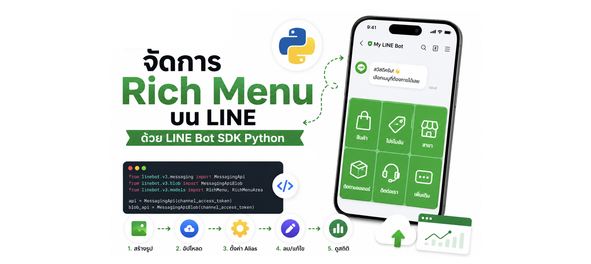

# LINE Rich Menu Python



โปรเจคตัวอย่างสำหรับจัดการ LINE Rich Menu ด้วย Python และ LINE Bot SDK v3

## โครงสร้างโปรเจค

```
line-rich-menu-python/
├── .env.example
├── requirements.txt
├── assets/
│   ├── schema.json
│   └── richmenu.jpg
├── 1_validate_create_delete.py
├── 2_get_and_list.py
├── 3_set_get_image.py
├── 4_set_default.py
├── 5_set_per_user.py
├── 6_link_multiple_users.py
├── 7_rich_menu_alias.py
└── 8_rich_menu_stat.py
```

## การติดตั้ง

```bash
python -m venv .venv
source .venv/bin/activate
pip install -r requirements.txt
cp .env.example .env
```

แก้ไข `.env`:

```env
CHANNEL_ACCESS_TOKEN=your_channel_access_token_here
DESTINATION_USER_ID=your_user_id_here
```

## การใช้งาน

รันจากโฟลเดอร์หลักของโปรเจค:

```bash
source .venv/bin/activate
```

| # | สคริปต์ | คำอธิบาย |
|---|---------|----------|
| 1 | `1_validate_create_delete.py` | ตรวจสอบ schema, สร้าง และลบ rich menu |
| 2 | `2_get_and_list.py` | ดึงรายการ rich menu และดึงข้อมูลตาม ID |
| 3 | `3_set_get_image.py` | อัปโหลดและดาวน์โหลดรูปภาพ rich menu |
| 4 | `4_set_default.py` | ตั้งค่า / ดึง / ยกเลิก default rich menu |
| 5 | `5_set_per_user.py` | ผูก / ยกเลิก / ดึง rich menu ของ user |
| 6 | `6_link_multiple_users.py` | ผูก / ยกเลิก rich menu กับหลาย users |
| 7 | `7_rich_menu_alias.py` | จัดการ rich menu alias (ใช้กับ tab switching) |
| 8 | `8_rich_menu_stat.py` | ดูสถิติ rich menu (summary / daily) และแสดงกราฟด้วย Plotly |

### ตัวอย่าง flow

```bash
# 1. สร้าง rich menu
python 1_validate_create_delete.py

# 2. อัปโหลดรูปภาพ (แก้ rich_menu_id ในสคริปต์ก่อนรัน)
python 3_set_get_image.py

# 3. ตั้งเป็น default หรือผูกกับ user
python 4_set_default.py
python 5_set_per_user.py

# 4. ดูสถิติ (แก้ rich_menu_id และช่วงวันที่ก่อนรัน)
python 8_rich_menu_stat.py
```

## Dependencies

- `python-dotenv` — โหลด environment variables
- `line-bot-sdk>=3.24.0` — LINE Bot SDK v3 (ต้องใช้ 3.24.0+ สำหรับ rich menu insight)
- `Pillow` — แสดงรูปภาพใน `3_set_get_image.py`
- `plotly` / `pandas` — แสดงกราฟ interactive ใน `8_rich_menu_stat.py`

## ไฟล์ที่สำคัญ

- `assets/schema.json` — JSON schema ของ rich menu
- `assets/richmenu.jpg` — รูปภาพ rich menu (2500×1686 หรือ 2500×843 px)
- `.env` — Channel Access Token และ User ID (ไม่ commit ขึ้น git)

## หมายเหตุ

- ต้องมี Channel Access Token จาก [LINE Developers Console](https://developers.line.biz/)
- รูปภาพ rich menu รองรับขนาด 2500×1686 หรือ 2500×843 pixels (JPEG/PNG)
- แก้ `rich_menu_id` และ `user_id` ในสคริปต์ก่อนรัน
- Rich menu alias (`7_rich_menu_alias.py`) ใช้ร่วมกับ `richmenuswitch` action สำหรับสลับแท็บ
- สถิติ rich menu (`8_rich_menu_stat.py`) ใช้ Insight API ได้เฉพาะ rich menu ที่สร้างผ่าน Messaging API
- ถ้า API คืนแค่ `richMenuId` โดยไม่มี `impression`/`clicks` มักเกิดจาก privacy threshold, ยังไม่มี usage หรือสถิติยังไม่พร้อม (มักพร้อมวันถัดไป)

## อ้างอิง

- [Use rich menus](https://developers.line.biz/en/docs/messaging-api/using-rich-menus/)
- [Use per-user rich menus](https://developers.line.biz/en/docs/messaging-api/use-per-user-rich-menus/)
- [Switch between tabs on rich menus](https://developers.line.biz/en/docs/messaging-api/switch-rich-menus/)
- [Rich menu insight](https://developers.line.biz/en/reference/messaging-api/#get-rich-menu-insight-summary)
